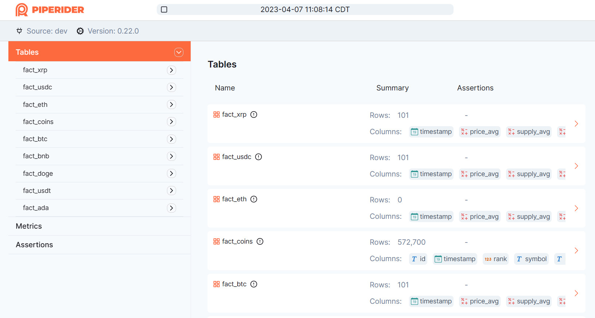
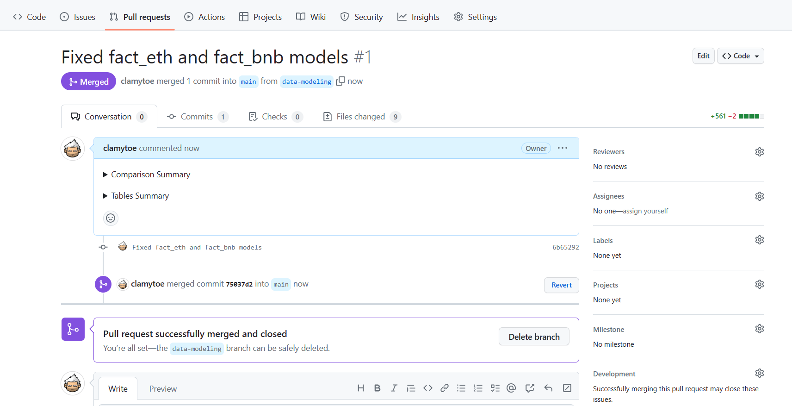

# Data Engineer Zoomcamp: Capstone Project (*dbt_crypto*)

> *This is the dbt portion for my capstone project as part of the DE Zoomcamp course.*

![Python version][python-version]
![Latest version][latest-version]
[![GitHub issues][issues-image]][issues-url]
[![GitHub forks][fork-image]][fork-url]
[![GitHub Stars][stars-image]][stars-url]
[![License][license-image]][license-url]

## dbt config

### Google Credentials

In order to be able to connect to your Google BigQuery account, you will need to provide your credentials. Once you have the file, save it to your local file system under `~./google/credentials/google_credentials.json`.

```bash
~ tree .google
.google
└── credentials
    └── google_credentials.json

1 directory, 1 file
```

### dbt Profile

Next you will need to create a profile in order to use with BQ. If you don't already have a `~/.dbt/profiles.yml`, create it. If you already have one, add this to the end of it:

*profiles.yml:*

```yaml
bq-dbt-decap:
  target: dev
  outputs:
    dev:
      dataset: dbt_crypto
      fixed_retries: 1
      keyfile: /.google/credentials/google_credentials.json
      location: us-central1
      method: service-account
      priority: interactive
      project: dtc-de-course-374214
      threads: 4
      timeout_seconds: 300
      type: bigquery
```

> **NOTE:** Use your own BigQuery values for `dataset`, `location`, and `project`!

### Docker Compose

Now it's time to build the image and run it.

```bash
~ docker compose build
[+] Building 21.0s (9/9) FINISHED
...
 => exporting to image                                                                                                                 1.6s
 => => exporting layers                                                                                                                1.6s
 => => writing image sha256:f954213c7281ec754f572a5c12a82a8f4f28f7bebfe5729369a503902c4af813                                           0.0s
 => => naming to docker.io/dbt/bigquery                                                                                                0.0s
```

Once the image is built, we can run a test to see if everything is configured properly:

```bash
(base) ➜  dbt_crypto_local git:(main) ✗ docker compose run dbt-bq-decap test
12:13:43  Running with dbt=1.5.0-b5
12:13:43  Found 10 models, 2 tests, 0 snapshots, 0 analyses, 355 macros, 0 operations, 0 seed files, 1 source, 0 exposures, 0 metrics, 0 groups
12:13:43
12:14:06  Concurrency: 4 threads (target='dev')
12:14:06
12:14:06  1 of 2 START test not_null_fact_coins_id ....................................... [RUN]
12:14:06  2 of 2 START test not_null_stg_coins_id ........................................ [RUN]
12:14:08  1 of 2 PASS not_null_fact_coins_id ............................................. [PASS in 2.42s]
12:14:10  2 of 2 PASS not_null_stg_coins_id .............................................. [PASS in 3.69s]
12:14:10
12:14:10  Finished running 2 tests in 0 hours 0 minutes and 26.42 seconds (26.42s).
12:14:10
12:14:10  Completed successfully
12:14:10
12:14:10  Done. PASS=2 WARN=0 ERROR=0 SKIP=0 TOTAL=2
```

To run a full test use the following command:

```bash
(base) ➜  dbt_crypto_local git:(main) ✗ docker compose run --workdir="//usr/app/dbt/" dbt-bq-decap debug
12:12:49  Running with dbt=1.5.0-b5
12:12:49  dbt version: 1.5.0-b5
12:12:49  python version: 3.11.2
12:12:49  python path: /usr/local/bin/python
12:12:49  os info: Linux-5.15.90.1-microsoft-standard-WSL2-x86_64-with-glibc2.31
12:12:49  Using profiles.yml file at /root/.dbt/profiles.yml
12:12:49  Using dbt_project.yml file at /usr/app/dbt/dbt_project.yml
12:12:49  Configuration:
12:12:50    profiles.yml file [OK found and valid]
12:12:50    dbt_project.yml file [OK found and valid]
12:12:50  Required dependencies:
12:12:50   - git [OK found]

12:12:50  Connection:
12:12:50    method: service-account
12:12:50    database: dtc-de-course-374214
12:12:50    schema: dbt_crypto
12:12:50    location: us-central1
12:12:50    priority: interactive
12:12:50    timeout_seconds: 300
12:12:50    maximum_bytes_billed: None
12:12:50    execution_project: dtc-de-course-374214
12:12:50    job_retry_deadline_seconds: None
12:12:50    job_retries: 1
12:12:50    job_creation_timeout_seconds: None
12:12:50    job_execution_timeout_seconds: 300
12:12:50    gcs_bucket: None
12:12:53    Connection test: [OK connection ok]

12:12:53  All checks passed!
```

## PipeRider

1. Update and install PipeRider.

```bash
pip install `piperider[bigquery]`
```

2. Create a new git branch

```bash
(decap) ➜  dbt_crypto_local git:(main) ✗ git switch -c data-modeling
Switched to a new branch 'data-modeling'
```

3. Build the dbt models

```bash
(decap) ➜  dbt_crypto_local git:(data-modeling) ✗ docker compose run dbt-bq-decap build
15:50:20  Running with dbt=1.5.0-b5
15:50:20  Found 10 models, 2 tests, 0 snapshots, 0 analyses, 355 macros, 0 operations, 0 seed files, 1 source, 0 exposures, 0 metrics, 0 groups
15:50:20
15:50:23  Concurrency: 4 threads (target='dev')
15:50:23
15:50:23  1 of 12 START sql view model dbt_crypto.stg_coins .............................. [RUN]
15:50:25  1 of 12 OK created sql view model dbt_crypto.stg_coins ......................... [CREATE VIEW (0 processed) in 2.15s]
15:50:25  2 of 12 START test not_null_stg_coins_id ....................................... [RUN]
15:50:29  2 of 12 PASS not_null_stg_coins_id ............................................. [PASS in 3.79s]
15:50:29  3 of 12 START sql table model dbt_crypto.fact_coins ............................ [RUN]
15:50:33  3 of 12 OK created sql table model dbt_crypto.fact_coins ....................... [CREATE TABLE (100.0 rows, 749.4 KiB processed) in 4.13s]
15:50:33  4 of 12 START test not_null_fact_coins_id ...................................... [RUN]
15:50:36  4 of 12 PASS not_null_fact_coins_id ............................................ [PASS in 2.74s]
15:50:36  5 of 12 START sql table model dbt_crypto.fact_ada .............................. [RUN]
15:50:36  6 of 12 START sql table model dbt_crypto.fact_bnb .............................. [RUN]
15:50:36  7 of 12 START sql table model dbt_crypto.fact_btc .............................. [RUN]
15:50:36  8 of 12 START sql table model dbt_crypto.fact_doge ............................. [RUN]
15:50:40  8 of 12 OK created sql table model dbt_crypto.fact_doge ........................ [CREATE TABLE (1.0 rows, 8.1 KiB processed) in 4.07s]
15:50:40  9 of 12 START sql table model dbt_crypto.fact_eth .............................. [RUN]
15:50:40  7 of 12 OK created sql table model dbt_crypto.fact_btc ......................... [CREATE TABLE (1.0 rows, 8.1 KiB processed) in 4.23s]
15:50:40  10 of 12 START sql table model dbt_crypto.fact_usdc ............................ [RUN]
15:50:41  5 of 12 OK created sql table model dbt_crypto.fact_ada ......................... [CREATE TABLE (1.0 rows, 8.1 KiB processed) in 4.42s]
15:50:41  11 of 12 START sql table model dbt_crypto.fact_usdt ............................ [RUN]
15:50:41  6 of 12 OK created sql table model dbt_crypto.fact_bnb ......................... [CREATE TABLE (0.0 rows, 8.1 KiB processed) in 4.46s]
15:50:41  12 of 12 START sql table model dbt_crypto.fact_xrp ............................. [RUN]
15:50:44  10 of 12 OK created sql table model dbt_crypto.fact_usdc ....................... [CREATE TABLE (1.0 rows, 8.1 KiB processed) in 3.90s]
15:50:44  9 of 12 OK created sql table model dbt_crypto.fact_eth ......................... [CREATE TABLE (0.0 rows, 8.1 KiB processed) in 4.06s]
15:50:44  12 of 12 OK created sql table model dbt_crypto.fact_xrp ........................ [CREATE TABLE (1.0 rows, 8.1 KiB processed) in 3.89s]
15:50:45  11 of 12 OK created sql table model dbt_crypto.fact_usdt ....................... [CREATE TABLE (1.0 rows, 8.1 KiB processed) in 3.95s]
15:50:45
15:50:45  Finished running 1 view model, 2 tests, 9 table models in 0 hours 0 minutes and 24.06 seconds (24.06s).
15:50:45
15:50:45  Completed successfully
15:50:45
15:50:45  Done. PASS=12 WARN=0 ERROR=0 SKIP=0 TOTAL=12
```

4. Initialize PipeRider

> **WARNING:** Make sure that you are in the `dbt/` directory to run the piperider commands.

```bash
(decap) ➜  dbt git:(data-modeling) ✗ piperider init
Initialize piperider to path /home/clamytoe/Projects/dbt_crypto_local/dbt/.piperider
[ DBT ] Use the existing dbt project file: /home/clamytoe/Projects/dbt_crypto_local/dbt/dbt_project.yml
────────────────────────────────────────────── .piperider/config.yml ──────────────────────────────────────────────
   1 dataSources: []
   2 dbt:
   3   projectDir: .
   4   # tag: 'piperider'
   5
   6 profiler:
   7 #   table:
   8 #     # the maximum row count to profile. (Default unlimited)
   9 #     limit: 1000000
  10 #     duplicateRows: false
  11
  12 telemetry:
  13   id: 223a86babc5c413a946f686b994f0af4
  14
────────────────────────────────────────── End of .piperider/config.yml ───────────────────────────────────────────
───────────────────────────────────── Recipe: .piperider/compare/default.yml ──────────────────────────────────────
   1 base:
   2   branch: main
   3   dbt:
   4     commands:
   5     - dbt deps
   6     - dbt build
   7   piperider:
   8     command: piperider run
   9 target:
  10   dbt:
  11     commands:
  12     - dbt deps
  13     - dbt build
  14   piperider:
  15     command: piperider run
  16
────────────────────────────────────────────────── End of Recipe ──────────────────────────────────────────────────

Next step:
  Please execute command 'piperider diagnose' to verify configuration
```

5. Because we are running dbt froma  docker container, we will need to trick it into thinking that it's getting the credentials files from within the cointainer:

```bash
(decap) ➜  dbt_crypto_local git:(data-modeling) ✗ sudo mkdir -p /.google/credentials/
(decap) ➜  dbt_crypto_local git:(data-modeling) ✗ sudo ln -s /home/clamytoe/.google/credentials/google_credentials.json /.google/credentials/google_credentials.json
```

6. Check PipeRider settings

```bash
(decap) ➜  dbt git:(data-modeling) ✗ piperider diagnose
Diagnosing...
PipeRider Version: 0.22.0
Check config files:
  /home/clamytoe/Projects/dbt_crypto_local/dbt/.piperider/config.yml: [OK]
✅ PASS

Check format of data sources:
  dev: [OK]
✅ PASS

Check connections:
  DBT: bigquery > bq-dbt-decap > dev [OK]
  Name: dev
  Type: bigquery
  connector: [OK]
  Connection: [OK]
✅ PASS

Check assertion files:
✅ PASS

🎉 You are all set!


Next step:
  Please execute command 'piperider run' to generate your first report
```

### Run PipeRider and data model changes

1. Run PipeRider

```bash
(decap) ➜  dbt git:(data-modeling) ✗ piperider run
DataSource: dev
─────────────────────────────────────────────────── Validating ────────────────────────────────────────────────────
everything is OK.
──────────────────────────────────────────────────── Profiling ────────────────────────────────────────────────────
[0/9]   METADATA   ━━━━━━━━━━━━━━━━━━━━━━━━━━━━━━━━━━━━━━━━━━━━━━━━━━━━━━━━━━━━━━━━━━━━━━━━━━━━━━━━   9/9 0:00:03
[1/9]   fact_xrp   ━━━━━━━━━━━━━━━━━━━━━━━━━━━━━━━━━━━━━━━━━━━━━━━━━━━━━━━━━━━━━━━━━━━━━━━━━━━━━━━━   6/6 0:00:15
[2/9]   fact_usdc  ━━━━━━━━━━━━━━━━━━━━━━━━━━━━━━━━━━━━━━━━━━━━━━━━━━━━━━━━━━━━━━━━━━━━━━━━━━━━━━━━   6/6 0:00:14
[3/9]   fact_eth   ━━━━━━━━━━━━━━━━━━━━━━━━━━━━━━━━━━━━━━━━━━━━━━━━━━━━━━━━━━━━━━━━━━━━━━━━━━━━━━━━   6/6 0:00:07
[4/9]   fact_coins ━━━━━━━━━━━━━━━━━━━━━━━━━━━━━━━━━━━━━━━━━━━━━━━━━━━━━━━━━━━━━━━━━━━━━━━━━━━━━━━━ 12/12 0:00:34
[5/9]   fact_btc   ━━━━━━━━━━━━━━━━━━━━━━━━━━━━━━━━━━━━━━━━━━━━━━━━━━━━━━━━━━━━━━━━━━━━━━━━━━━━━━━━   6/6 0:00:15
[6/9]   fact_bnb   ━━━━━━━━━━━━━━━━━━━━━━━━━━━━━━━━━━━━━━━━━━━━━━━━━━━━━━━━━━━━━━━━━━━━━━━━━━━━━━━━   6/6 0:00:07
[7/9]   fact_doge  ━━━━━━━━━━━━━━━━━━━━━━━━━━━━━━━━━━━━━━━━━━━━━━━━━━━━━━━━━━━━━━━━━━━━━━━━━━━━━━━━   6/6 0:00:13
[8/9]   fact_usdt  ━━━━━━━━━━━━━━━━━━━━━━━━━━━━━━━━━━━━━━━━━━━━━━━━━━━━━━━━━━━━━━━━━━━━━━━━━━━━━━━━   6/6 0:00:14
[9/9]   fact_ada   ━━━━━━━━━━━━━━━━━━━━━━━━━━━━━━━━━━━━━━━━━━━━━━━━━━━━━━━━━━━━━━━━━━━━━━━━━━━━━━━━   6/6 0:00:15
───────────────────────────────────────────────────── Summary ─────────────────────────────────────────────────────

  Table Name   #Columns Profiled   #Tests Executed   #Tests Failed
 ━━━━━━━━━━━━━━━━━━━━━━━━━━━━━━━━━━━━━━━━━━━━━━━━━━━━━━━━━━━━━━━━━━
  fact_xrp                     5                 0               0
  fact_usdc                    5                 0               0
  fact_eth                     5                 0               0
  fact_coins                  11                 0               0
  fact_btc                     5                 0               0
  fact_bnb                     5                 0               0
  fact_doge                    5                 0               0
  fact_usdt                    5                 0               0
  fact_ada                     5                 0               0

Generating reports from: /home/clamytoe/Projects/dbt_crypto_local/dbt/.piperider/outputs/latest/run.json
Report generated in /home/clamytoe/Projects/dbt_crypto_local/dbt/.piperider/outputs/latest/index.html

Next step:
  Please execute command 'piperider run' to generate your second report
```

PipeRider will profile the database and output the path to your data report. View the HTML report to see the full statistical report of your data source.



As you can see, there is sometehing wrong with my Ethereum table! It's not visible in this image, but I had the same issue with Binance Coin.

2. Make data model changes
  a. Modify `models/core/fact_bnb.sql` to use correct symbol name
  b. Modify `models/core/fact_eth.sql` to correct type-o

3. Rebuild the models

```bash
(decap) ➜  dbt_crypto_local git:(data-modeling) ✗ docker compose run dbt-bq-decap build
16:27:41  Running with dbt=1.5.0-b5
16:27:41  Found 10 models, 2 tests, 0 snapshots, 0 analyses, 355 macros, 0 operations, 0 seed files, 1 source, 0 exposures, 0 metrics, 0 groups
16:27:41
16:28:59  Concurrency: 4 threads (target='dev')
16:28:59
16:28:59  1 of 12 START sql view model dbt_crypto.stg_coins .............................. [RUN]
16:29:02  1 of 12 OK created sql view model dbt_crypto.stg_coins ......................... [CREATE VIEW (0 processed) in 2.37s]
16:29:02  2 of 12 START test not_null_stg_coins_id ....................................... [RUN]
16:29:05  2 of 12 PASS not_null_stg_coins_id ............................................. [PASS in 3.34s]
16:29:05  3 of 12 START sql table model dbt_crypto.fact_coins ............................ [RUN]
16:29:09  3 of 12 OK created sql table model dbt_crypto.fact_coins ....................... [CREATE TABLE (100.0 rows, 709.3 KiB processed) in 3.94s]
16:29:09  4 of 12 START test not_null_fact_coins_id ...................................... [RUN]
16:29:12  4 of 12 PASS not_null_fact_coins_id ............................................ [PASS in 3.38s]
16:29:12  5 of 12 START sql table model dbt_crypto.fact_ada .............................. [RUN]
16:29:12  6 of 12 START sql table model dbt_crypto.fact_bnb .............................. [RUN]
16:29:12  7 of 12 START sql table model dbt_crypto.fact_btc .............................. [RUN]
16:29:12  8 of 12 START sql table model dbt_crypto.fact_doge ............................. [RUN]
16:29:17  5 of 12 OK created sql table model dbt_crypto.fact_ada ......................... [CREATE TABLE (1.0 rows, 8.1 KiB processed) in 4.01s]
16:29:17  8 of 12 OK created sql table model dbt_crypto.fact_doge ........................ [CREATE TABLE (1.0 rows, 8.1 KiB processed) in 4.02s]
16:29:17  9 of 12 START sql table model dbt_crypto.fact_eth .............................. [RUN]
16:29:17  10 of 12 START sql table model dbt_crypto.fact_usdc ............................ [RUN]
16:29:17  7 of 12 OK created sql table model dbt_crypto.fact_btc ......................... [CREATE TABLE (1.0 rows, 8.1 KiB processed) in 4.06s]
16:29:17  6 of 12 OK created sql table model dbt_crypto.fact_bnb ......................... [CREATE TABLE (1.0 rows, 8.1 KiB processed) in 4.06s]
16:29:17  11 of 12 START sql table model dbt_crypto.fact_usdt ............................ [RUN]
16:29:17  12 of 12 START sql table model dbt_crypto.fact_xrp ............................. [RUN]
16:29:20  11 of 12 OK created sql table model dbt_crypto.fact_usdt ....................... [CREATE TABLE (1.0 rows, 8.1 KiB processed) in 3.21s]
16:29:20  9 of 12 OK created sql table model dbt_crypto.fact_eth ......................... [CREATE TABLE (1.0 rows, 8.1 KiB processed) in 3.57s]
16:29:20  12 of 12 OK created sql table model dbt_crypto.fact_xrp ........................ [CREATE TABLE (1.0 rows, 8.1 KiB processed) in 3.46s]
16:29:20  10 of 12 OK created sql table model dbt_crypto.fact_usdc ....................... [CREATE TABLE (1.0 rows, 8.1 KiB processed) in 3.61s]
16:29:20
16:29:20  Finished running 1 view model, 2 tests, 9 table models in 0 hours 1 minutes and 39.03 seconds (99.03s).
16:29:20
16:29:20  Completed successfully
16:29:20
16:29:20  Done. PASS=12 WARN=0 ERROR=0 SKIP=0 TOTAL=12
```

4. Run PipeRider again to generate the second data report with the updated models.

```bash
(decap) ➜  dbt_crypto_local git:(data-modeling) ✗ cd dbt
(decap) ➜  dbt git:(data-modeling) ✗ piperider run
DataSource: dev
─────────────────────────────────────────────────── Validating ────────────────────────────────────────────────────
everything is OK.
──────────────────────────────────────────────────── Profiling ────────────────────────────────────────────────────
[0/9]   METADATA   ━━━━━━━━━━━━━━━━━━━━━━━━━━━━━━━━━━━━━━━━━━━━━━━━━━━━━━━━━━━━━━━━━━━━━━━━━━━━━━━━   9/9 0:00:17
[1/9]   fact_xrp   ━━━━━━━━━━━━━━━━━━━━━━━━━━━━━━━━━━━━━━━━━━━━━━━━━━━━━━━━━━━━━━━━━━━━━━━━━━━━━━━━   6/6 0:00:15
[2/9]   fact_usdc  ━━━━━━━━━━━━━━━━━━━━━━━━━━━━━━━━━━━━━━━━━━━━━━━━━━━━━━━━━━━━━━━━━━━━━━━━━━━━━━━━   6/6 0:00:14
[3/9]   fact_coins ━━━━━━━━━━━━━━━━━━━━━━━━━━━━━━━━━━━━━━━━━━━━━━━━━━━━━━━━━━━━━━━━━━━━━━━━━━━━━━━━ 12/12 0:00:25
[4/9]   fact_btc   ━━━━━━━━━━━━━━━━━━━━━━━━━━━━━━━━━━━━━━━━━━━━━━━━━━━━━━━━━━━━━━━━━━━━━━━━━━━━━━━━   6/6 0:00:14
[5/9]   fact_doge  ━━━━━━━━━━━━━━━━━━━━━━━━━━━━━━━━━━━━━━━━━━━━━━━━━━━━━━━━━━━━━━━━━━━━━━━━━━━━━━━━   6/6 0:00:14
[6/9]   fact_usdt  ━━━━━━━━━━━━━━━━━━━━━━━━━━━━━━━━━━━━━━━━━━━━━━━━━━━━━━━━━━━━━━━━━━━━━━━━━━━━━━━━   6/6 0:00:13
[7/9]   fact_ada   ━━━━━━━━━━━━━━━━━━━━━━━━━━━━━━━━━━━━━━━━━━━━━━━━━━━━━━━━━━━━━━━━━━━━━━━━━━━━━━━━   6/6 0:00:19
[8/9]   fact_eth   ━━━━━━━━━━━━━━━━━━━━━━━━━━━━━━━━━━━━━━━━━━━━━━━━━━━━━━━━━━━━━━━━━━━━━━━━━━━━━━━━   6/6 0:00:13
[9/9]   fact_bnb   ━━━━━━━━━━━━━━━━━━━━━━━━━━━━━━━━━━━━━━━━━━━━━━━━━━━━━━━━━━━━━━━━━━━━━━━━━━━━━━━━   6/6 0:00:14
───────────────────────────────────────────────────── Summary ─────────────────────────────────────────────────────

  Table Name   #Columns Profiled   #Tests Executed   #Tests Failed
 ━━━━━━━━━━━━━━━━━━━━━━━━━━━━━━━━━━━━━━━━━━━━━━━━━━━━━━━━━━━━━━━━━━
  fact_xrp                     5                 0               0
  fact_usdc                    5                 0               0
  fact_coins                  11                 0               0
  fact_btc                     5                 0               0
  fact_doge                    5                 0               0
  fact_usdt                    5                 0               0
  fact_ada                     5                 0               0
  fact_eth                     5                 0               0
  fact_bnb                     5                 0               0

Generating reports from: /home/clamytoe/Projects/dbt_crypto_local/dbt/.piperider/outputs/latest/run.json
Report generated in /home/clamytoe/Projects/dbt_crypto_local/dbt/.piperider/outputs/latest/index.html

Next step:
  Please execute command 'piperider compare-reports' to get the comparison report
```

5. Use the `compare-results` function to compare the data profile reports.

```bash
(decap) ➜  dbt git:(data-modeling) ✗ piperider compare-reports --last
──────────────────────────────────────────────── Comparison report ────────────────────────────────────────────────
Selected reports:
  Base:   /home/clamytoe/Projects/dbt_crypto_local/dbt/.piperider/outputs/dev-20230407110814/run.json
  Target: /home/clamytoe/Projects/dbt_crypto_local/dbt/.piperider/outputs/dev-20230407113123/run.json

Comparison report: /home/clamytoe/Projects/dbt_crypto_local/dbt/.piperider/comparisons/latest/index.html
Comparison summary: /home/clamytoe/Projects/dbt_crypto_local/dbt/.piperider/comparisons/latest/summary.md
```

The comparison summary markdown can now be used as a pull request (PR) comment.

*summary:**

<details>
<summary>Comparison Summary</summary>

Table | Rows | Columns
--- | --- | ---
fact_xrp | 0 (-1) | 5 (+0)
fact_coins | 100 (+0) | 11 (+0)
fact_btc | 4 (+3) | 5 (+0)
fact_doge | 0 (-1) | 5 (+0)
fact_usdt | 0 (-1) | 5 (+0)
fact_ada | 0 (-1) | 5 (+0)
fact_eth | 0 (-1) | 5 (+0)
fact_bnb | 0 (-1) | 5 (+0)
fact_forecast (+) | 14040 | 3
fact_usdc | 0 (-1) | 5 (+0)

</details>
<details>
<summary>Tables Summary (added=1)</summary>
<blockquote>

<details>
<summary>fact_xrp</summary>

Column | Type | Valid % | Distinct %
--- | --- | --- | ---
timestamp | TIMESTAMP | - | -
price_avg | NUMERIC | - | -
supply_avg | NUMERIC | - | -
volume_avg | NUMERIC | - | -
change_percent_avg | NUMERIC | - | -

</details>
<details>
<summary>fact_coins</summary>

Column | Type | Valid % | Distinct %
--- | --- | --- | ---
id | VARCHAR | 100.0% (+0.0%) | 1.0% (-99.0%)
timestamp | TIMESTAMP | 100.0% (+0.0%) | 100.0% (+99.0%)
rank | INTEGER | 100.0% (+0.0%) | 1.0% (-99.0%)
symbol | VARCHAR | 100.0% (+0.0%) | 1.0% (-99.0%)
name | VARCHAR | 100.0% (+0.0%) | 1.0% (-99.0%)
supply | NUMERIC | 100.0% (+0.0%) | 2.0% (-96.0%)
market_cap_usd | NUMERIC | 100.0% (+0.0%) | 100.0% (+0.0%)
volume_usd_24hr | NUMERIC | 100.0% (+0.0%) | 100.0% (+0.0%)
price_usd | NUMERIC | 100.0% (+0.0%) | 100.0% (+0.0%)
change_percent_24hr | NUMERIC | 100.0% (+0.0%) | 90.0% (-10.0%)
url | VARCHAR | 100.0% (+0.0%) | 1.0% (-98.0%)

</details>
<details>
<summary>fact_btc</summary>

Column | Type | Valid % | Distinct %
--- | --- | --- | ---
timestamp | TIMESTAMP | 100.0% (+0.0%) | 100.0% (+0.0%)
price_avg | NUMERIC | 100.0% (+0.0%) | 100.0% (+0.0%)
supply_avg | NUMERIC | 100.0% (+0.0%) | 50.0% (-50.0%)
volume_avg | NUMERIC | 100.0% (+0.0%) | 100.0% (+0.0%)
change_percent_avg | NUMERIC | 100.0% (+0.0%) | 100.0% (+0.0%)

</details>
<details>
<summary>fact_doge</summary>

Column | Type | Valid % | Distinct %
--- | --- | --- | ---
timestamp | TIMESTAMP | - | -
price_avg | NUMERIC | - | -
supply_avg | NUMERIC | - | -
volume_avg | NUMERIC | - | -
change_percent_avg | NUMERIC | - | -

</details>
<details>
<summary>fact_usdt</summary>

Column | Type | Valid % | Distinct %
--- | --- | --- | ---
timestamp | TIMESTAMP | - | -
price_avg | NUMERIC | - | -
supply_avg | NUMERIC | - | -
volume_avg | NUMERIC | - | -
change_percent_avg | NUMERIC | - | -

</details>
<details>
<summary>fact_ada</summary>

Column | Type | Valid % | Distinct %
--- | --- | --- | ---
timestamp | TIMESTAMP | - | -
price_avg | NUMERIC | - | -
supply_avg | NUMERIC | - | -
volume_avg | NUMERIC | - | -
change_percent_avg | NUMERIC | - | -

</details>
<details>
<summary>fact_eth</summary>

Column | Type | Valid % | Distinct %
--- | --- | --- | ---
timestamp | TIMESTAMP | - | -
price_avg | NUMERIC | - | -
supply_avg | NUMERIC | - | -
volume_avg | NUMERIC | - | -
change_percent_avg | NUMERIC | - | -

</details>
<details>
<summary>fact_bnb</summary>

Column | Type | Valid % | Distinct %
--- | --- | --- | ---
timestamp | TIMESTAMP | - | -
price_avg | NUMERIC | - | -
supply_avg | NUMERIC | - | -
volume_avg | NUMERIC | - | -
change_percent_avg | NUMERIC | - | -

</details>
<details>
<summary>fact_forecast (+)</summary>

Column | Type | Valid % | Distinct %
--- | --- | --- | ---
symbol (+) | VARCHAR | 100.0% | 0.78%
hour (+) | TIMESTAMP | 100.0% | 0.98%
avg_price_usd (+) | NUMERIC | 100.0% | 99.81%

</details>
<details>
<summary>fact_usdc</summary>

Column | Type | Valid % | Distinct %
--- | --- | --- | ---
timestamp | TIMESTAMP | - | -
price_avg | NUMERIC | - | -
supply_avg | NUMERIC | - | -
volume_avg | NUMERIC | - | -
change_percent_avg | NUMERIC | - | -

</details>
</blockquote></details>

6. Commit your changes and push your branch.

```bash
(decap) ➜  dbt git:(data-modeling) ✗ git add .
(decap) ➜  dbt git:(data-modeling) ✗ git commit -m "Fixed fact_eth and fact_bnb models"
[data-modeling 6b65292] Fixed fact_eth and fact_bnb models
 9 files changed, 561 insertions(+), 2 deletions(-)
 create mode 100644 dbt/.piperider/.gitignore
 create mode 100644 dbt/.piperider/assertions/placeholder.txt
 create mode 100644 dbt/.piperider/compare/default.yml
 create mode 100644 dbt/.piperider/config.yml
 create mode 100644 dbt/.piperider/plugins/customized_assertions.py.template
 create mode 100644 images/pr-run.png
(decap) ➜  dbt git:(data-modeling) git push origin data-modeling
Enter passphrase for key '/home/clamytoe/.ssh/id_ed25519':
Enumerating objects: 26, done.
Counting objects: 100% (26/26), done.
Delta compression using up to 12 threads
Compressing objects: 100% (15/15), done.
Writing objects: 100% (19/19), 123.20 KiB | 2.24 MiB/s, done.
Total 19 (delta 4), reused 0 (delta 0), pack-reused 0
remote: Resolving deltas: 100% (4/4), completed with 4 local objects.
remote:
remote: Create a pull request for 'data-modeling' on GitHub by visiting:
remote:      https://github.com/clamytoe/dbt_crypto_local/pull/new/data-modeling
remote:
To github.com:clamytoe/dbt_crypto_local.git
 * [new branch]      data-modeling -> data-modeling
```

7. Create a pull request
  a. Visit your repo on GitHub and click `Compare & pull report`
  b. Copy the contents of the comparison summary Markdown file into your pull request comment box
  c. Click `preview` to see how the comparison looks
  d. Click `Create pull request` to submit your changes



## License

Distributed under the terms of the [MIT](https://opensource.org/licenses/MIT) license, "de_capstone" is free and open source software.

## Issues

If you encounter any problems, please [file an issue](https://github.com/clamytoe/toepack/issues) along with a detailed description.

[python-version]:https://img.shields.io/badge/python-3.10.9-brightgreen.svg
[latest-version]:https://img.shields.io/badge/version-0.1.0-blue.svg
[issues-image]:https://img.shields.io/github/issues/clamytoe/de_capstone.svg
[issues-url]:https://github.com/clamytoe/de_capstone/issues
[fork-image]:https://img.shields.io/github/forks/clamytoe/de_capstone.svg
[fork-url]:https://github.com/clamytoe/de_capstone/network
[stars-image]:https://img.shields.io/github/stars/clamytoe/de_capstone.svg
[stars-url]:https://github.com/clamytoe/de_capstone/stargazers
[license-image]:https://img.shields.io/github/license/clamytoe/de_capstone.svg
[license-url]:https://github.com/clamytoe/de_capstone/blob/master/LICENSE
